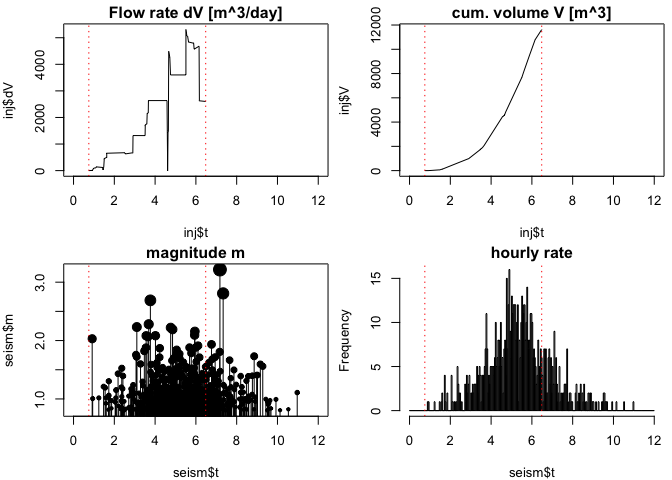

rseismTLS
================
Arnaud Mignan
4 July 2019

<!-- README.md is generated from README.Rmd. Please edit that file -->
<!-- badges: start -->
<!-- badges: end -->
The rise in the frequency of anthropogenic earthquakes due to deep fluid injections is posing serious economic, societal, and legal challenges to many geo-energy and waste-disposal projects. The rseismTLS package provides actuarial tools to analyse, forecast and mitigate induced seismicity during underground stimulation, based on a TLS (i.e. Traffic Light System) procedure. It reflects the need to quantify the dynamic nature of the industrial operations and underground feedback, and complements the standard TLS approach that is inherently heuristic and mostly based on expert elicitation (so-called clinical judgment).

What rseismTLS does:

-   Models the seismicity induced by fluid injection in the underground, using a simple statistical model;
-   Models the seismicity trailing effect (post-injection) based on a simple relaxation function;
-   Forecasts future seismicity based on planned underground stimulation (COMING SOON);
-   Estimates the magnitude threshold above which stimulation must be stopped to respect a risk-based safety criterion (COMING SOON);
-   Computes the seismic risk for a point source based on the RISK-UE method and EMS98 scale (COMING LATER);
-   Estimates the probability of reaching the magnitude threshold based on the seismicity forecast (COMING LATER).

What rseismTLS needs:

-   An earthquake catalogue (1 induced seismicity sequence so far included in `/data` for testing);
-   The matching fluid injection profile (1 injection profile so far included in `/data` for testing).

Disclaimer
----------

The rseismTLS package is provided "as is", without warranty of any kind. In no event shall the author or copyright holder be liable for any claim, damages or other liability (see MIT `LICENSE` file).

Installation
------------

You can install rseismTLS from github with:

``` r
# install.packages("devtools")
devtools::install_github("amignan/rseismTLS")
```

Input example
-------------

One dataset is so far provided (see `data/`), which is a susbet of the 2006 Basel, Switzerland, EGS experiment (Häring et al., 2008; Kraft and Deichmann, 2014). The injection profile `Basel2006_inj` was digitized from Häring et al. (2008) and the catalogue `Basel2006_seism` taken from the dataset provided by Kraft and Deichmann (2014), here limited to the initial 12 days (c. 6 days of stimulation and 6 days of post-injection decay) and to magnitude information only (spatial component not included). We will use this dataset to illustrate the various functionalities of rseismTLS. We will consistently use the following naming convention: `inj` for the injection profile and `seism` for the earthquake catalogue. User-created data sets should systematically be in the following units: decimal days for time and cubic metres for injected volumes. This will conform with the standard way the model parameters are defined (see next section).

``` r
## Load 2006 Basel EGS data ##
inj <- rseismTLS::Basel2006_inj
seism <- rseismTLS::Basel2006_seism
# time t [decimal days] every minute,
# volume dV [m^3] in the minute preceding t,
# and cumulative volume V [m^3] up to t
tail(inj, 5)       
#>             t        dV        V
#> 9306 6.461806 1.8080300 11576.11
#> 9307 6.462500 1.8080300 11577.92
#> 9308 6.463194 1.8080300 11579.73
#> 9309 6.463889 0.9777826 11580.71
#> 9310 6.464583 0.0000000 11580.71
#
# same time t reference, event magnitudes m
head(seism, 5)
#>           t   m
#> 1 0.9203546 0.4
#> 2 1.0102819 0.5
#> 3 1.0144468 0.9
#> 4 1.0255598 0.6
#> 5 1.0412036 1.4
```

``` r
# illustrate how decimal days are computed
initdate <- strptime("2006-12-02 00:00:00.00", "%Y-%m-%d %H:%M:%OS")
#start injection = 2 December, 6:00 pm
startdate <- strptime("2006-12-02 18:00:00.00", "%Y-%m-%d %H:%M:%OS")
t.start <- as.double(startdate)/86400-as.double(initdate)/86400
#end injection = 8 December, 11:33 am
enddate <- strptime("2006-12-08 11:33:00.00", "%Y-%m-%d %H:%M:%OS")
t.shutin <- as.double(enddate)/86400-as.double(initdate)/86400

# plot data
par(mfrow = c(2,2))
plot(inj$t, inj$dV, type = 'l', xlim = c(0,12),
     main = 'Volume dV [m^3]')
abline(v = c(t.start, t.shutin), lty = 'dotted', col = 'red')
abline(h = 0, lty = 'dotted')

plot(inj$t, inj$V, type = 'l', xlim = c(0,12),
     main = 'cum. volume V [m^3]')
abline(v = c(t.start, t.shutin), lty = 'dotted', col = 'red')

plot(seism$t, seism$m, xlim = c(0,12),
     main = 'magnitude m')
abline(v = c(t.start, t.shutin), lty = 'dotted', col = 'red')

hist(seism$t, breaks = seq(0, 12, 1/24), xlim = c(0,12),
     main = 'hourly rate')
abline(v = c(t.start, t.shutin), lty = 'dotted', col = 'red')
```



Forecast functions
------------------

The following examples make use of all the forecast functions of rseismTLS, which are listed in `R/forecast.R`. Only the frequentist approach developed by Mignan et al. (2017) is so far available (see also Mignan et al., 2019a; 2019b). The bayesian approach developed by Broccardo et al. (2017) will be implemented at a later date.

### Frequentist approach

Note that we also use functions from the rseismNet package for data preprocessing, i.e. to compute the completeness magnitude `mc` and the slope of the Gutenberg-Richter law `b` (see [rseismNet README](https://github.com/amignan/rseismNet) for details and how to install the package).

``` r
## mandatory preprocessing ##
# step 1: filter out incomplete data
#         & get Gutenberg-Richter stats
mbin <- .1
mc <- rseismNet::mc.val(seism$m, method = 'mode', mbin)  # see other methods in rseismNet
seism <- subset(seism, m > mc - mbin / 2)
b <- rseismNet::beta.mle(seism$m, mc, mbin) / log(10)    # Aki (1965) MLE method
theta.GR <- list(mc = mc, b = b)                         # Gutenberg-Richter parameter list

# step 2: bin injection & earthquake data in dt time bins
dt <- 1/6    # [days] find trade-off between temporal resolution & sample size
data.binned <- rseismTLS::data.bin(seism, inj, dt)
#> Loading required package: signal
#> 
#> Attaching package: 'signal'
#> The following objects are masked from 'package:stats':
#> 
#>     filter, poly
rate.obs <- data.binned$seism.rate
inj.binned <- data.binned$inj.binned
```

We will now fit the following statistical model (Mignan et al., 2017) to our seismicity data:

$$\\sum\_{i=1}^n X\_i$$

``` r
NULL
#> NULL
```

### Frequentist approach

TO BE COMPLETED.

Risk functions
--------------

TO BE COMPLETED.

References
----------

Broccardo

Haering (2008)

Kraft T., Deichmann N. (2014), High-precision relocation and focal mechanism of the injection-induced seismicity at the Basel EGS. Geothermics, 52, 59–73, doi: 10.1016/j.geothermics.2014.05.014

Mignan A., Karnouvis D., Broccardo M., Wiemer S., Giardini D. (2019), Including seismic risk mitigation measures into the Levelized Cost Of Electricity in enhanced geothermal systems for optimal siting. Applied Energy, 238, 831-850, doi: 10.1016/j.apenergy.2019.01.109

Mignan A., Broccardo M., Wiemer S., Giardini D. (2019), Autonomous Decision-Making Against Induced Seismicity in Deep Fluid Injections. In: Ferrari A., Laloui L. (eds), Energy Geotechnics, SEG 2018, Springer Series in Geomechanics and Geoengineering, , 369-376, doi: 10.1007/978-3-319-99670-7\_46

Mignan A., Broccardo M., Wiemer S., Giardini D. (2017), Induced seismicity closed-form traffic light system for actuarial decision-making during deep fluid injections. Scientific Reportsvolume, 7, 13607, doi: 10.1038/s41598-017-13585-9

Mignan A., Landtwing D., Kaestli P., Mena B., Wiemer S. (2015), Induced seismicity risk analysis of the 2006 Basel, Switzerland, Enhanced Geothermal System project: Influence of uncertainties on risk mitigation. Geothermics, 53, 133-146, doi: 10.1016/j.geothermics.2014.05.007
