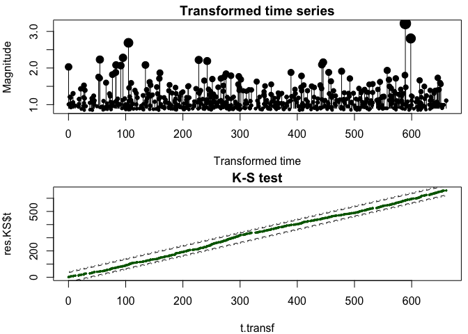

<!-- README.md is generated from README.Rmd. Please edit that file -->


<!-- badges: start -->
<!-- badges: end -->

The rise in the frequency of anthropogenic earthquakes due to deep fluid injections is posing serious economic, societal, and legal challenges to many geo-energy and waste-disposal projects. The rseismTLS package provides actuarial tools to analyse, forecast and mitigate induced seismicity during underground stimulation, based on a TLS (i.e. Traffic Light System) procedure. It reflects the need to quantify the dynamic nature of the industrial operations and underground feedback, and complements the standard TLS approach that is inherently heuristic and mostly based on expert elicitation (so-called clinical judgment).

What rseismTLS does:

- Models the seismicity induced by fluid injection in the underground, based on the linear relationship between flow rate and seismicity rate;
- Models the seismicity trailing effect (post-injection) based on an exponential relaxation function;
- Forecasts future seismicity based on planned underground stimulation (COMING SOON);
- Estimates the magnitude threshold above which stimulation must be stopped to respect a risk-based safety criterion (COMING SOON);
- Computes the seismic risk for a point source based on the RISK-UE method and EMS98 scale (COMING LATER);
- Estimates the probability of reaching the magnitude threshold based on the seismicity forecast (COMING LATER).

What rseismTLS needs:

- An earthquake catalogue (one induced seismicity sequence so far included in `/data` for testing);
- The matching fluid injection profile (one injection profile so far included in `/data` for testing).

## Disclaimer

The rseismTLS package is provided "as is", without warranty of any kind. In no event shall the author or copyright holder be liable for any claim, damages or other liability (see MIT `LICENSE` file).

## Installation

You can install rseismTLS from github with:


```r
# install.packages("devtools")
devtools::install_github("amignan/rseismTLS")
```

## Input example

One dataset is so far provided (see `data/`), which is a susbet of the 2006 Basel, Switzerland, EGS experiment (Häring et al., 2008; Kraft and Deichmann, 2014). The injection profile `Basel2006_inj` was digitized from Häring et al. (2008) and the catalogue `Basel2006_seism` taken from the dataset provided by Kraft and Deichmann (2014), here limited to the initial 12 days (c. 6 days of stimulation and 6 days of post-injection decay) and to magnitude information only (spatial component not included). We will use this dataset to illustrate the various functionalities of rseismTLS. We will consistently use the following naming convention: `inj` for the injection profile and `seism` for the earthquake catalogue. User-created data sets must be in the following units: decimal days for time and cubic metres for injected volumes. Moreover, since the model so far does not include negative flow rates (i.e., bleed-off in post-injection phase), the injection flow rate must stop at the shut-in time and any negative flow rate during the injection phase be fixed to zero (this case is fortunately very rare). Following those rules will conform with the rseismTLS model computations.


```r
## Load 2006 Basel EGS data ##
inj <- rseismTLS::Basel2006_inj
seism <- rseismTLS::Basel2006_seism
# time t [days], flow rate dV [m^3/day], cumulative volume V [m^3]
tail(inj, 5)       
#>          t       dV        V
#> 36 5.91488 4569.869  9652.23
#> 37 6.15537 4680.778 10777.91
#> 38 6.17162 2626.776 10820.59
#> 39 6.46357 2603.563 11580.71
#> 40 6.48125 2603.563 11626.74
#
# same time t reference, event magnitudes m
head(seism, 5)
#>           t   m
#> 1 0.9203546 0.4
#> 2 1.0102819 0.5
#> 3 1.0144468 0.9
#> 4 1.0255598 0.6
#> 5 1.0412036 1.4
```


```r
# illustrate how decimal days are computed
initdate <- strptime("2006-12-02 00:00:00.00", "%Y-%m-%d %H:%M:%OS")
# start injection = 2 December, 6:00 pm
startdate <- strptime("2006-12-02 18:00:00.00", "%Y-%m-%d %H:%M:%OS")
t.start <- as.double(startdate)/86400-as.double(initdate)/86400
# end injection = 8 December, 11:33 am
enddate <- strptime("2006-12-08 11:33:00.00", "%Y-%m-%d %H:%M:%OS")
( t.shutin <- as.double(enddate)/86400-as.double(initdate)/86400 )
#> [1] 6.48125
# note that the time of the last row in inj (see above) must equal t.shutin

# plot data
par(mfrow = c(2,2))
plot(inj$t, inj$dV, type = 'l', xlim = c(0,12), main = 'Flow rate dV [m^3/day]')
abline(v = c(t.start, t.shutin), lty = 'dotted', col = 'red')

plot(inj$t, inj$V, type = 'l', xlim = c(0,12), main = 'cum. volume V [m^3]')
abline(v = c(t.start, t.shutin), lty = 'dotted', col = 'red')

plot(seism$t, seism$m, xlim = c(0,12), main = 'magnitude m')
abline(v = c(t.start, t.shutin), lty = 'dotted', col = 'red')

hist(seism$t, breaks = seq(0, 12, 1/24), xlim = c(0,12), main = 'hourly rate')
abline(v = c(t.start, t.shutin), lty = 'dotted', col = 'red')
```


## Forecast functions

The following examples make use of all the forecast functions of rseismTLS, which are listed in `R/forecast.R`. They are based on the statistical model of Mignan et al. (2017):

$$\lambda (t, m \ge m_c; \theta) = \begin{cases} 10^{a_{fb}-b m_c} \dot V (t) & ; t \le t_{shut-in} \\ 
  10^{a_{fb}-b m_c} \dot V (t_{shut-in}) \exp (- \frac{t-t_{shut-in}}{\tau})  & ; t > t_{shut-in} \end{cases}$$

where $\lambda$ is the predicted seismicity rate above completeness magnitude $m_c$, $\dot V$ the flow rate, $a_{fb}$ the underground activation feedback (equivalent to the seismogenic index; e.g. Dinske and Shapiro, 2013) and $\tau$ the mean relaxation time (Mignan et al., 2017). The linear relationship between seismicity rate $\lambda$ and flow rate $\dot V$ is well recognised (Dinske and Shapiro, 2013; Mignan, 2016; van der Elst et al., 2016; Mignan et al., 2017; Broccardo et al., 2017). Use of the exponential decay during the post-injection phase was proposed by Mignan et al. (2017).

Only the frequentist approach developed by Mignan et al. (2017) is so far available. The bayesian approach developed by Broccardo et al. (2017) will be implemented at a later date. Physics-based models are so far not considered. 

### Frequentist approach (likelihood)

Note that we first need to use functions from the rseismNet package for data preprocessing, here to compute the completeness magnitude $m_c$ (see [rseismNet README](https://amignan.github.io/rseismNet/README.html) for details).


```r
## mandatory preprocessing ##
#devtools::install_github("amignan/rseismNet")   #in case rseismNet not yet installed
mbin <- .1
mc <- rseismNet::mc.val(seism$m, method = 'mode', mbin)      # see other methods in rseismNet
seism <- subset(seism, m > mc - mbin / 2)                    # complete earthquake catalogue
(b.Aki <- rseismNet::beta.mle(seism$m, mc, mbin) / log(10))  # Aki (1965) MLE method
#> [1] 1.580881
```

The model parameters are estimated with `model_par.mle_point()` by minimizing the negative log-likelihood function `negloglik_point.val()`, as given in Broccardo et al. (2017:A2):


```r
data <- list(seism = seism, inj = inj, m0 = mc, ts = t.shutin, Tmax = 12)
( par.MLE <- rseismTLS::model_par.mle_point(data) )
#> Loading required package: signal
#> 
#> Attaching package: 'signal'
#> The following objects are masked from 'package:stats':
#> 
#>     filter, poly
#> $a_fb
#> [1] 0.09139539
#> 
#> $tau
#> [1] 1.09832
#> 
#> $b
#> [1] 1.580615
#> 
#> $nLL
#> [1] -4161.768
```

Note that the $b$ estimate is close to the MLE value obtained directly from the frequency-magnitude distribution (see `b.Aki`). We can also calculate $a_{fb}$ via the Shapiro Seismogenic Index (SI) method (e.g., Dinske and Shapiro, 2013)


```r
( Vtot <- tail(inj$V, 1) )        # cubic meters
#> [1] 11626.74
( a_fb.SI <- rseismTLS::a_fb.val(nrow(seism), b.Aki, mc, Vtot) )
#> [1] 0.186466
```

The predicted seismicity rate $\lambda$ per time bin `tbin` is calculated by `model_rate.val()`, which input is binned by `data.bin()`:


```r
# bucketize injection & seismicity data into tbin time bins
tbin <- 1/6                # [days]
tint <- seq(0, 12, tbin)    # [days]
data.binned <- rseismTLS::data.bin(seism, inj, tint)
seism.binned <- data.binned$seism.binned
inj.binned <- data.binned$inj.binned

ind.post <- which(seism.binned$t > tail(inj.binned$t, 1))
rate.pred <- rseismTLS::model_rate.val('full sequence', 
                                       list(a_fb = par.MLE$a_fb, tau = par.MLE$tau, b = par.MLE$b, mc = mc), 
                                       inj = inj.binned, shutin = list(t = t.shutin), 
                                       t.postinj = seism.binned$t[ind.post])

par(mfrow = c(1, 1))
hist(seism$t, breaks = tint, main = 'full sequence', col = 'grey', border = 'white')
lines(rate.pred, col = 'darkred')
abline(v = c(t.start, t.shutin), col = 'red', lty = 'dotted')
```



We used the option `window = 'full sequence'`, which means that the rate sequence is continuous. Considering the `injection` and `post-injection` separately can lead to a discontinuity (play with different values of `tbin` to test the impact of binning). Those two options should only be used when data is limited to one of the two phases.


```r
rate_inj.pred <- rseismTLS::model_rate.val('injection', 
                                             list(a_fb = par.MLE$a_fb, b = par.MLE$b, mc = mc),
                                             inj = inj.binned)

rate_postinj.pred <- rseismTLS::model_rate.val('post-injection',
                                               list(tau = par.MLE$tau),
                                               shutin = list(t = t.shutin, 
                                                             rate = seism.binned$rate[ind.post[1] - 1]),
                                               t.postinj = seism.binned$t[ind.post])

hist(seism$t, breaks = tint, main = 'injection + post-injection (v.1)', col = 'grey', border = 'white')
lines(rate_inj.pred$t, rate_inj.pred$rate, col = 'darkred')
lines(rate_postinj.pred$t, rate_postinj.pred$rate, col = 'darkblue')
abline(v = c(t.start, t.shutin), col = 'red', lty = 'dotted')
```


In the case of independent time windows on each side of the shut-in time, the model parameters should be estimated for those specific periods. This is done as previously, but now adding the `window` type in `model_par.mle_point()`:


```r
data_inj <- list(seism = subset(seism, t <= t.shutin), inj = inj, m0 = mc, ts = t.shutin, Tmax = 12)
( par_inj.MLE <- rseismTLS::model_par.mle_point(data_inj, window = 'injection') )
#> $a_fb
#> [1] 0.2177736
#> 
#> $tau
#> [1] NA
#> 
#> $b
#> [1] 1.745873
#> 
#> $nLL
#> [1] -3516.938

data_post <- list(seism = subset(seism, t > t.shutin), m0 = mc, ts = t.shutin, Tmax = 12, 
                  lambda0 = seism.binned$rate[ind.post[1] - 1] / tbin)
( par_post.MLE <- rseismTLS::model_par.mle_point(data_post, list(a_fb = 0, tau = 1, b = 1), window = 'post-injection') )
#> $a_fb
#> [1] NA
#> 
#> $tau
#> [1] 0.9148888
#> 
#> $b
#> [1] 1.160303
#> 
#> $nLL
#> [1] -657.2135
```

The parameter estimates here differ due to the fact that there is no constraint to have a continuous function over the full sequence. The next plot shows that the difference is not significant for $a_{fb}$ and $\tau$. In the Basel dataset, the $b$-value is known to decrease over time, which is here clearly visible (compare `par_inj.MLE$b` to `par_post.MLE$b`).


```r
rate_inj.pred <- rseismTLS::model_rate.val('injection', 
                                             list(a_fb = par_inj.MLE$a_fb, b = par_inj.MLE$b, mc = mc),
                                             inj = inj.binned)

rate_postinj.pred <- rseismTLS::model_rate.val('post-injection',
                                               list(tau = par_post.MLE$tau),
                                               shutin = list(t = t.shutin, 
                                                             rate = seism.binned$rate[ind.post[1] - 1]),
                                               t.postinj = seism.binned$t[ind.post])

hist(seism$t, breaks = tint, main = 'injection + post-injection (v.2)', col = 'grey', border = 'white')
lines(rate_inj.pred$t, rate_inj.pred$rate, col = 'darkred')
lines(rate_postinj.pred$t, rate_postinj.pred$rate, col = 'darkblue')
abline(v = c(t.start, t.shutin), col = 'red', lty = 'dotted')
```


#### NB: when the earthquake count data is available instead of an earthquake catalogue

In the case in which only the seismicity rate `seism.binned` is available (e.g, catalogue not available but histogram data digitizable from a published figure), the model parameters can still be estimated. Then the Poisson log-likelihood function `negloglik_hist.val()` is used instead of `negloglik_point.val()`, assuming a Non-Homogeneous Poisson Process (NHPP). It is computed, and the model parameters optimized, in `model_par.mle_hist()`:


```r
# MLE values based on binned data
data <- list(seism.binned = seism.binned, inj.binned = inj.binned, b = b.Aki, m0 = mc, ts = t.shutin)
( par.MLE <- rseismTLS::model_par.mle_hist(data) )
#> $a_fb
#> [1] 0.08788649
#> 
#> $tau
#> [1] 1.104109
#> 
#> $nLL
#> [1] 156.6454

data_inj <- list(seism.binned = subset(seism.binned, t <= t.shutin), inj.binned = inj.binned, b = b.Aki, m0 = mc)
( par_inj.MLE <- rseismTLS::model_par.mle_hist(data_inj, window = 'injection') )
#> $a_fb
#> [1] 0.08229297
#> 
#> $tau
#> [1] NA
#> 
#> $nLL
#> [1] 98.59394

data_post <- list(seism.binned = subset(seism.binned, t > t.shutin), ts = t.shutin,
                  lambda0 = tail(seism.binned$rate[seism.binned$t <= t.shutin], 1))
( par_post.MLE <- rseismTLS::model_par.mle_hist(data_post, window = 'post-injection') )
#> $a_fb
#> [1] NA
#> 
#> $tau
#> [1] 0.9159418
#> 
#> $nLL
#> [1] 60.03801
```


### Bayesian approach

TO BE COMPLETED.


## Risk functions

TO BE COMPLETED.

## References

Broccardo M., Mignan A., Wiemer S., Stojadinovic B., Giardini D. (2017), Hierarchical Bayesian Modeling of Fluid‐Induced Seismicity. Geophysical Research Letters, 44 (22), 11,357-11,367, doi: 10.1002/2017GL075251 

Dinske C., Shapiro S.A. (2013), Seismotectonic state of reservoirs inferred from magnitude distributions of fluid-induced seismicity. J. Seismol., 17, 13-25, doi: 10.1007/s10950-012-9292-9

Häring M.O., Schanz U., Ladner F., Dyer B.C. (2008), Characterisation of the Basel 1 enhanced geothermal system, Geothermics, 37 (5), 469-495, doi: 10.1016/j.geothermics.2008.06.002

Kraft T., Deichmann N. (2014), High-precision relocation and focal mechanism of the injection-induced seismicity at the Basel EGS.
Geothermics, 52, 59–73, doi: 10.1016/j.geothermics.2014.05.014

Mignan A., Karnouvis D., Broccardo M., Wiemer S., Giardini D. (2019), Including seismic risk mitigation measures into the Levelized Cost Of Electricity in enhanced geothermal systems for optimal siting. Applied Energy, 238, 831-850, doi: 10.1016/j.apenergy.2019.01.109

Mignan A., Broccardo M., Wiemer S., Giardini D. (2019), Autonomous Decision-Making Against Induced Seismicity in Deep Fluid Injections. In: Ferrari A., Laloui L. (eds), Energy Geotechnics, SEG 2018, Springer Series in Geomechanics and Geoengineering, , 369-376, doi: 10.1007/978-3-319-99670-7_46

Mignan A., Broccardo M., Wiemer S., Giardini D. (2017), Induced seismicity closed-form traffic light system for actuarial decision-making during deep fluid injections. Scientific Reportsvolume, 7, 13607, doi: 10.1038/s41598-017-13585-9

Mignan A., Landtwing D., Kaestli P., Mena B., Wiemer S. (2015), Induced seismicity risk analysis of the 2006 Basel, Switzerland, Enhanced Geothermal System project: Influence of uncertainties on risk mitigation. Geothermics, 53, 133-146, doi: 10.1016/j.geothermics.2014.05.007

van der Elst N.J., Page M.T., Weiser D.A., Goebel T.H.W., Hosseini S.M. (2016), Induced earthquake magnitudes are as large as (statistically) expected. J. Geophys. Res., 121 (6), 4575-4590, doi: 10.1002/2016JB012818

